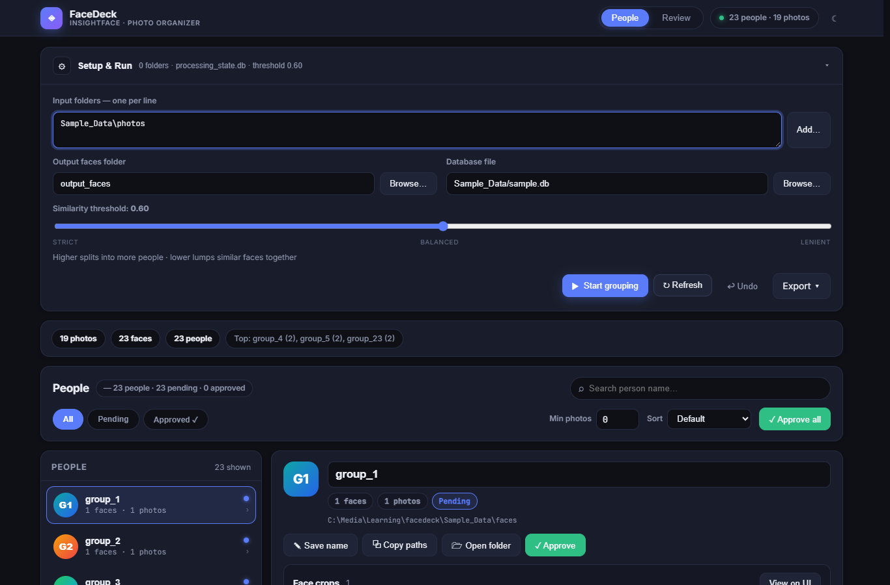
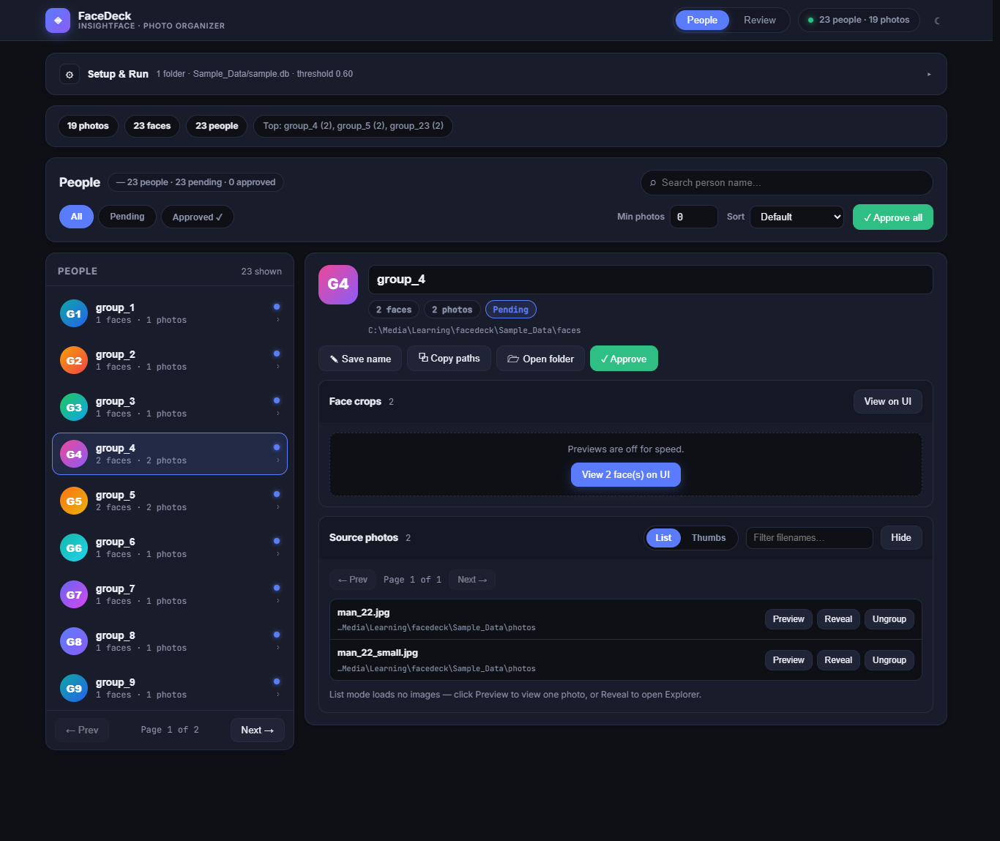
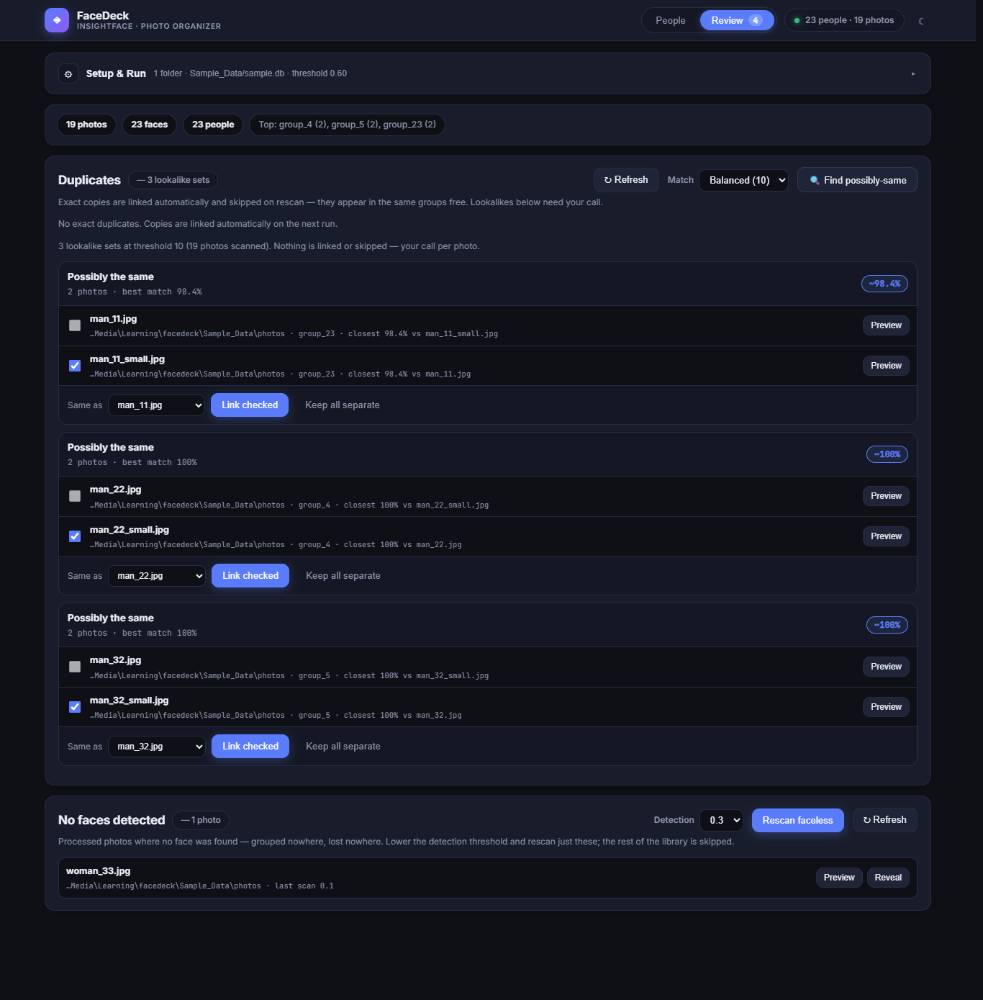
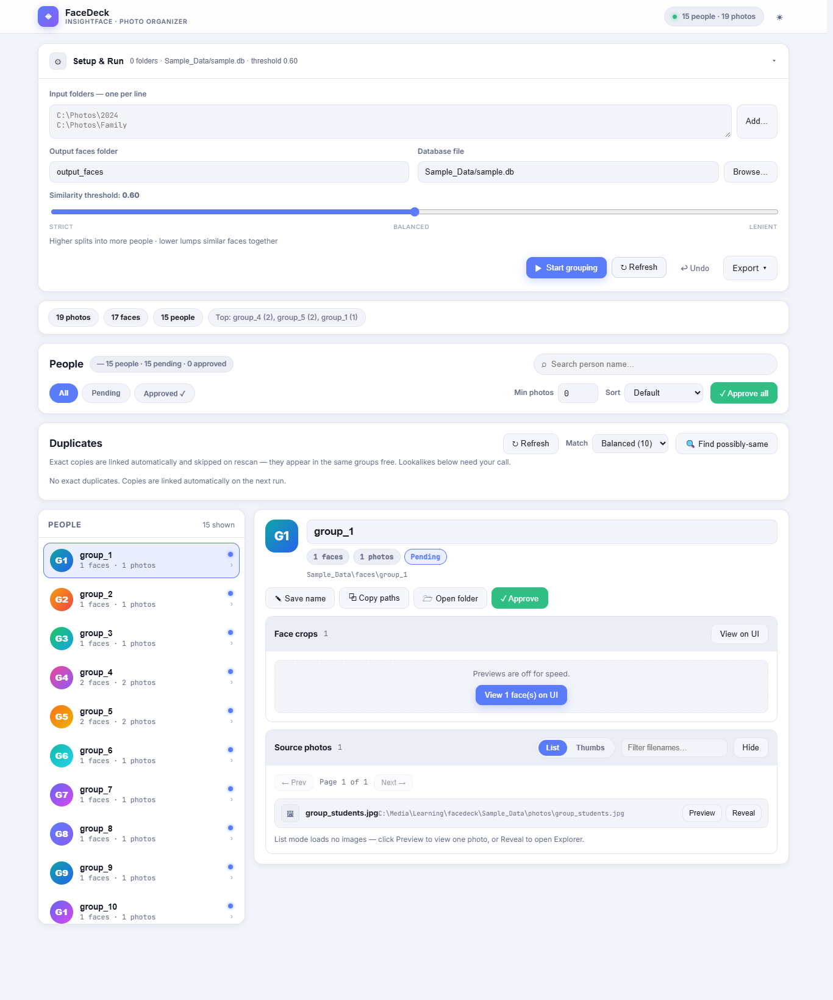
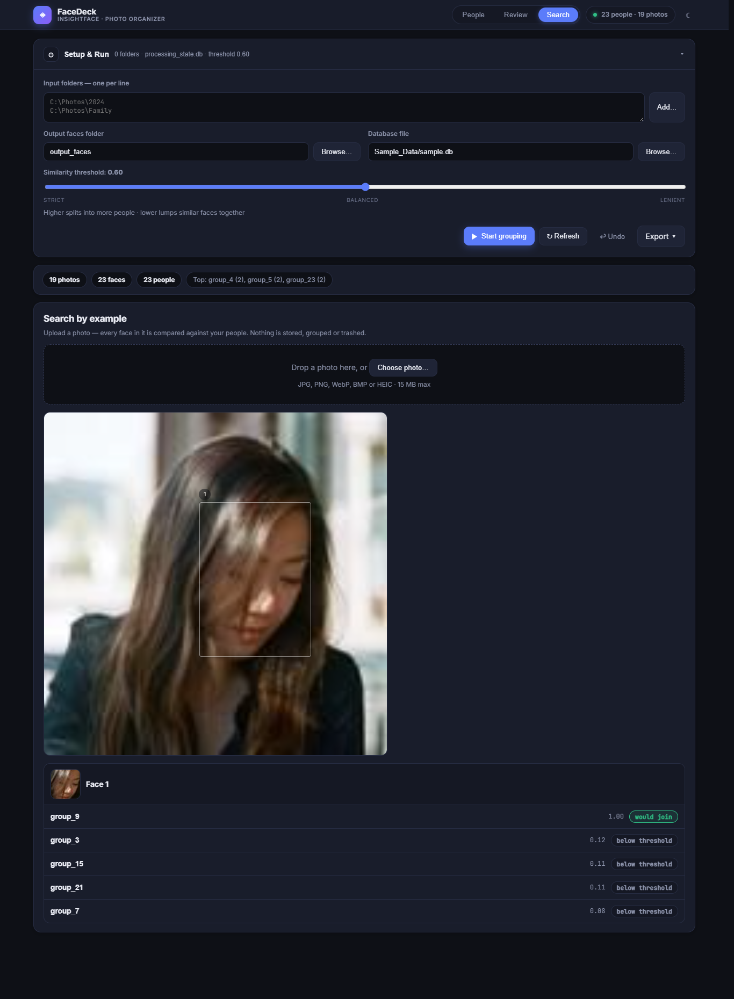

# FaceDeck — Automatic Face Grouping & Photo Organizer

> Group thousands of photos by **who is in them**. Face detection + clustering with InsightFace, duplicate detection, and a fast web UI for review and curation.

**Search keywords:** face grouping, face clustering, group photos by person, sort photos by face, InsightFace photo organizer, face recognition for local photo library, find duplicate photos, HEIC face detection, organize iPhone photos by person.

FaceDeck scans one or more photo folders, detects faces, and clusters similar faces into **People** (`group_1`, `group_2`, …). You then rename, merge/split, approve, and export — all locally, no cloud upload.

Works with `JPG / JPEG / PNG / BMP / TIFF / WEBP / HEIC / HEIF`, including iPhone HEIC and EXIF-rotated photos.

---

## Screenshots

> Captured from a real run on freely-available demo photos ([randomuser.me](https://randomuser.me) portraits + [Unsplash](https://unsplash.com) group shots): 19 photos → 23 faces → 23 people (low-threshold rescans rescued faces the default run missed). No personal photos are shown.

| Setup & Run | People review | Photo with face tags |
|---|---|---|
|  |  |  |
| Setup with native Browse buttons for every field; People/Review tabs up top | Rename, filter, approve, move/delete/ungroup faces (here: two resolutions of one person correctly grouped) | Hover a box to see the name, click to jump to that person |

| Review tab | Dark / light theme |
|---|---|
|  |  |
| Lookalike sets with match % and Link checked / Keep all separate, plus No-faces with detection picker and Rescan faceless | Theme toggle is remembered in the browser |

| Search by example |
|---|
|  |
| Upload any photo — every face is ranked against your people with similarity scores; click a match to jump to them |

To reproduce these shots with the same demo data (the `Sample_Data/` folder is git-ignored, so download it first or use your own photos):

```bash
python face_grouping_v5.py --input_folder Sample_Data/photos --output_faces Sample_Data/faces --db_file Sample_Data/sample.db
# rescue missed faces: re-process ONLY faceless photos with lower detection
python face_grouping_v5.py --input_folder Sample_Data/photos --output_faces Sample_Data/faces --db_file Sample_Data/sample.db --only-faceless --det-thresh 0.3
python face_grouping_web.py
# open http://127.0.0.1:5000, set Database file to Sample_Data/sample.db, Refresh
```

---

## Features

### Detection & grouping
- Face detection + embeddings with **InsightFace `buffalo_l`** (auto-downloaded on first run)
- Cosine-similarity clustering with adjustable **threshold slider (0.30–0.90, default 0.60)**
- **Multiple input folders** per run
- **EXIF orientation normalized** at detection and serving time, so crops and boxes line up
- Stable **face IDs** (`photo-stem + folder-hash + index`) — same filenames in different folders don't collide

### Incremental & resumable
- **SQLite state DB** (`processing_state.db`) tracks processed files by `mtime + size`
- Re-runs only scan **new/changed photos**
- **Live checkpoints** every 100 photos / 20 s — people stream into the UI during a run
- Run header states the **resolved DB path + existing people count**, warns on a **brand-new DB** or **input folders differing from last run**
- Cancel button saves progress so far

### Review UI (web, recommended)
- Three tabs keep things uncluttered: **People** (browse + curate), **Review** (duplicates + no-faces, with a count badge so open items don't get ignored), and **Search** (search by example); tab choice is remembered and hash-routed (`#/people`, `#/review`, `#/search`)
- **Search by example** tab: drop in any photo — or capture one with your camera (device picker, live preview; works on localhost/HTTPS) — every detected face is ranked against all people with similarity scores and a would-join/below-threshold hint; click a match to jump to that person. Read-only: nothing is stored, grouped or trashed
- Fast **People list** — no images loaded up front, safe for thousands of photos
- Search by name, filter **All / Pending / Approved**, min-photos filter, sort (Default, Name A–Z, Most/Fewest photos, Newest), pagination
- Person detail: face count, photo count, folder path, **rename** (stored in DB)
- Face crops: **paginated, lazy-loaded grid**, click-to-view (never auto-loads everything)
- Source photos: **text-row list by default** (zero images), optional thumbnail grid, per-photo **Preview** (single-image viewer) + **Reveal** (opens Explorer / Finder / file manager on the server), **Open folder** for the whole group
- **Lightbox viewer** with prev/next, counter, and the source photo(s) each face came from
- **Facebook-style face tags**: hover boxes with names on source photos, click a tag to open that person
- **Copy all source photo paths** of a group to clipboard
- **No faces detected** section: processed photos with zero faces, listed with Preview + Reveal and refreshed after every run — nothing silently disappears. **Rescan faceless** re-processes only these photos with a lower *detection* threshold (0.4–0.1); the rest of the library is skipped. Each photo remembers its last scan threshold, so repeating the same (or a higher) threshold is refused per photo — escalate 0.4 → 0.3 → 0.2 instead of re-running blindly
- **Stats chips**: photos processed, faces, largest groups
- **Dark / light theme**, remembered in `localStorage`; responsive layout

### Curation (correct mistakes)
- Move faces: single move dialog, **bulk move** (Ctrl-click / Shift-click multi-select), or **drag-and-drop between groups**; create new group on the fly (named or auto `group_N`)
- Moving a crop also moves its **source photo's group link** via face tags; a photo leaves its old group only when none of its faces remain there
- **Delete** crops to a `.trash` folder (undoable); deleting unlinks the photo the same way
- **Ungroup** a source photo (button on each photo row): removes it from all groups and sends it back to **No faces detected**. Crops go to trash (undoable), and the exact faces are remembered as rejected so future rescans don't resurrect them. Rejections are independent of undo — each faceless row shows its rejected count with an **Allow again** button that re-arms the photo for rescans at any threshold
- **Approve / Approve all**: approved people are done; face crops are cleaned up, photos stay listed
- **Delete empty groups only** (no faces, no photos) from the detail panel, with undo
- **Undo** last move / delete / ungroup / group-delete (50 entries kept)
- Curation **pauses during a run** (409 + visual lock) so checkpoints can't clobber edits; renames stay allowed
- **Keyboard shortcuts**: arrows navigate faces, `Enter` opens lightbox, `M` moves, `Delete` removes, `Esc` closes dialogs

### Duplicates
- **Exact duplicates** (SHA-256 content hash) auto-detected, **linked not rescanned**, shown in the same groups automatically
- **Duplicates panel** lists copy sets; delete sends copies to the **OS Recycle Bin / Trash** (`send2trash`)
- **Find possibly-same** (perceptual `dHash`) lookalike scan with Strict (6) / Balanced (10) / Loose (14) modes — results grouped into **one set per cluster** (no mirrored rows, safe for 10–20 burst photos) with a **match %** (best per set, closest per photo) — tick photos, pick the canonical, **Link checked**, or **Keep all separate**
- Source photos are **never deleted inside the app except via that panel**

### Export & interfaces
- Export groups as **CSV or JSON** (group id, name, directory, face + source-photo lists)
- Two interfaces: **Web UI** (`face_grouping_web.py`, recommended) and **CLI** (`face_grouping_v5.py`, scripting/headless)
- Cross-platform Reveal: Windows Explorer `/select`, macOS Finder `-R`, Linux `xdg-open` / `gio`

---

## Quickstart (3 steps)

```bash
# 1. Install (Python 3.10+, 3.12 recommended)
pip install -r requirements.txt

# 2. Run the web app
python face_grouping_web.py

# 3. Open in your browser
# http://127.0.0.1:5000
```

Then: `Setup & Run` → add input folder(s) → `Start grouping` → select a person → rename / move / delete / approve → `Export CSV/JSON`.

First run downloads the InsightFace `buffalo_l` model (~300 MB) automatically.

---

## Installation

### Prerequisites
- **Python 3.10+** (3.12 recommended). Check with `python --version`.
- ~1 GB free for models + face crops.
- Optional: **NVIDIA GPU + CUDA** for faster processing. CPU works, just slower.

### Install dependencies

```bash
pip install -r requirements.txt
```

`requirements.txt` includes: `opencv-python`, `numpy`, `insightface`, `pillow`, `pillow-heif`, `flask`, `tqdm`, `pathvalidate`, `imagehash`, `send2trash`.

Notes:
- **Windows**: plain `pip install -r requirements.txt` works. If `insightface` fails to build, upgrade pip first: `python -m pip install -U pip`.
- **macOS**: `pip install -r requirements.txt`. HEIC works via `pillow-heif`. Reveal uses Finder.
- **Linux**: you may need system libs for OpenCV/HEIF first, e.g. on Debian/Ubuntu: `sudo apt install libgl1 libglib2.0-0`. Reveal uses `xdg-open` / `gio`.
- **GPU (optional)**: install CUDA + cuDNN matching your `onnxruntime` build and keep `CUDAExecutionProvider` first (already configured). The app falls back to CPU automatically.

---

## Usage

### A. Web app (recommended)

```bash
python face_grouping_web.py
# open http://127.0.0.1:5000
```

1. **Setup & Run**: paste one folder per line (or `Add…` for a native folder dialog), set output faces folder (`Browse…`) + DB file (`Browse…`), pick threshold.
2. **Start grouping**: watch the progress bar, counts, and log. People appear while it runs. Use **Cancel** to stop safely.
3. **People tab**: search / filter / sort on top, click a person on the left.
4. **Person detail**: rename at the top, `View` face crops (paginated), review the auto-loaded source-photo list (`Preview` / `Reveal` / `Ungroup` per photo), `Open folder` for the group folder.
5. **Fix mistakes**: select faces (Ctrl/Shift-click) → Move / Delete via the bottom bulk bar, or drag a tile onto another person in the list. `Undo` reverts the last batch.
6. **Review tab**: Duplicates card → `Refresh`, optionally `Find possibly-same` → link or keep; No faces detected → `Rescan faceless` at a lower detection threshold, or `Allow again` for previously rejected faces.
7. **Search tab**: drop in any photo to find which person each face belongs to.
8. **Approve** people you're happy with, then **Export CSV/JSON**.

### B. CLI (scripting / headless)

```bash
# Minimal
python face_grouping_v5.py --input_folder /path/to/images

# Full
python face_grouping_v5.py \
  --input_folder /path/to/images \
  --output_faces output_faces \
  --threshold 0.6 \
  --db_file processing_state.db \
  --only-faceless \
  --det-thresh 0.3
```

| Flag | Required | Default | Meaning |
|---|---|---|---|
| `--input_folder` | Yes | — | Folder scanned recursively for images |
| `--output_faces` | No | `output_faces` | Where cropped faces are saved (`group_N/*.jpg`) |
| `--threshold` | No | `0.6` | Cosine similarity to join a group. Higher = stricter (more people). Lower = lenient (fewer, merged people). |
| `--db_file` | No | `processing_state.db` | SQLite state file for resume + tags + names |
| `--det-thresh` | No | `0.5` | Face *detection* confidence (0.05–0.9). Lower finds more faces but also more false alarms. Different from `--threshold`, which only affects grouping. |
| `--only-faceless` | No | off | Rescan ONLY processed photos with no detected faces (pairs with `--det-thresh`). Everything else is skipped. |

---

## Threshold guide

Two different thresholds — don't mix them up:

- **Similarity `--threshold` (default 0.6)**: decides whether a *detected* face joins an existing person. Only affects grouping.
- **Detection `--det-thresh` (default 0.5)**: the detector's confidence floor. Only this helps photos with **no faces at all** — lower it (e.g. 0.3) and rescan just those via the **Rescan faceless** button or `--only-faceless`. Lower values find more faces but also more false alarms (background patterns flagged as faces). Repeat runs at the same or a higher threshold are skipped per photo automatically.

| Value | Behavior | When to use |
|---|---|---|
| `0.70–0.90` | Strict, splits into more people | Lookalikes / family members getting merged |
| `0.55–0.65` | Balanced (start with `0.60`) | Most personal libraries |
| `0.30–0.50` | Lenient, merges aggressively | Same person split across lighting/age, then split manually |

You can re-run with a different threshold — only new/changed photos are reprocessed; existing groups are kept and matched against.

---

## How it works

1. **Discover**: recursively list images (`jpg/jpeg/png/bmp/tiff/webp/heic/heif`), skip unchanged files via `(mtime, size)`.
2. **Deduplicate**: SHA-256 exact-match check → alias registered in `duplicates`, file skipped (not re-encoded).
3. **Detect + embed**: `read_image` (HEIC + EXIF-aware) → InsightFace `buffalo_l` → bbox + 512-d embedding per face. Faces you trashed/ungrouped are skipped via the rejection memory (IoU match), so rescans don't resurrect them.
4. **Cluster**: cosine similarity vs. running group average → join best group if `≥ threshold`, else create `group_N`. Crop saved to `output_faces/group_N/<face_id>.jpg`.
5. **Tag**: normalized bbox + owning group written to `photo_faces` (drives hover tags + photo↔group links). Each photo also records the detection threshold it was scanned with, so repeat rescans at the same/higher threshold skip it automatically.
6. **Checkpoint**: `processed_files` + `groups` + tags flushed to SQLite every 100 photos / 20 s and at the end.

---

## Output & project structure

```text
facedeck/
├── face_grouping_web.py   # Web UI + REST API (recommended entrypoint)
├── face_grouping_v5.py    # Core engine + CLI (detection, grouping, DB schema)
├── templates/index.html   # Web UI shell
├── static/style.css       # Dark/light theme
├── static/js/             # Web UI logic (people, review tabs, duplicates, faceless, viewer)
├── docs/screenshots/      # README screenshots (from git-ignored demo data)
├── Sample_Data/           # Demo photos + sample DB/faces (git-ignored, optional)
├── tests/test_web_api.py  # API tests (77 cases)
├── Test/                  # Sample images (git-ignored)
├── output_faces/          # Cropped faces: group_1/*.jpg … + .trash/ (git-ignored)
├── processing_state.db    # SQLite state: files, groups, names, tags, dupes, undo (git-ignored)
└── requirements.txt
```

- `output_faces/group_N/`: one folder per person, face crops only. `.trash/` holds deleted crops for undo.
- `processing_state.db`: the source of truth. Groups belong to the **DB, not the folder** — reuse the same DB to keep names/curation; use a fresh DB to start over.
- Use **Export CSV/JSON** in the web UI for portable reports (the DB is an internal format).

---

## Typical curation workflow

1. Run grouping on your library.
2. Sort People by **Most photos** → rename the biggest groups first.
3. Open each person → `View` faces → multi-select outliers → **Move** to the right person (or a new group).
4. **Delete** non-faces / junk crops (goes to `.trash`, undoable). **Ungroup** whole mis-grouped photos back to No faces detected.
5. Check the **Review tab**: delete true copies (→ OS trash), link or keep lookalikes; `Rescan faceless` at a lower detection threshold for missed faces.
6. **Approve** clean people; **delete** groups only once they're fully empty.
7. **Export** CSV/JSON for backup or sharing.

---

## Troubleshooting / FAQ

**No faces found?**
- Check the format list and that `input_folders` point at files, not at the `output_faces` folder.
- Very small / blurry / profile faces may need a lower threshold or better originals.
- Open the **Review tab → No faces detected**: missed photos collect there with a **Rescan faceless** button that re-processes only them at a lower detection threshold.

**Too many groups (one person split)?** Lower the threshold slightly (e.g. `0.60 → 0.55`) and re-run, then merge leftovers with bulk-move.

**Different people merged?** Raise the threshold (e.g. `0.60 → 0.68`) for the next run, then split with move-to-new-group.

**Model download slow / fails?** First run fetches `buffalo_l` from InsightFace model zoo. Retry with internet on, or pre-download per [InsightFace docs](https://github.com/deepinsight/insightface).

**CUDA not used / falls back to CPU?** Normal without a CUDA setup — processing still works, just slower. Install a CUDA-enabled `onnxruntime-gpu` matching your driver to speed up.

**HEIC won't open?** Ensure `pillow-heif` installed (`pip install -r requirements.txt`). iPhone HEIC + HEIF both supported.

**Boxes misaligned?** Shouldn't happen — orientation is normalized at detection and serving. Photos processed by very old versions (before tagging) show no boxes until reprocessed.

**Old DB / output from before?** Face IDs changed to include a folder hash. Rebuild from scratch: delete (or rename) the old `.db` + `output_faces`, then re-run.

**Locked during run (409 "grouping run in progress")?** Expected — move/delete/approve/undo pause while checkpoints write. Wait for finish/cancel; renaming still works.

**Where is Reveal opening?** On the **server machine** (where `face_grouping_web.py` runs), not on a remote browser — by design for local libraries.

---

## Performance tips

- Start with a **subset folder** to tune threshold, then run the full library.
- Keep the **summary list** (default) for browsing; only open face grids / thumbnails for the person you're curating.
- GPU + `det_size=(640,640)` default is a good speed/accuracy trade-off.
- Thousands of photos are fine — photos list is paginated (`?page=&per_page=&q=`), faces paginated (`?page=&per_page=`).

---

## Tests

```bash
python -m pytest tests/ -q
```

Covers the web API (groups, faces/photos pagination, rename, move/delete/undo guards, duplicates, faceless + ungroup + rejection allow-again, bulk DB routing, detection-threshold guards, search ranking, export).

---

## Privacy

100% local. Photos, embeddings, crops, and the database never leave your machine. The only network access is the one-time InsightFace model download (plus Google Fonts in the web UI, which you can remove if fully offline).

---

## License

No license file is shipped with this repo yet. Add one (e.g. MIT) if you plan to share or accept contributions.
